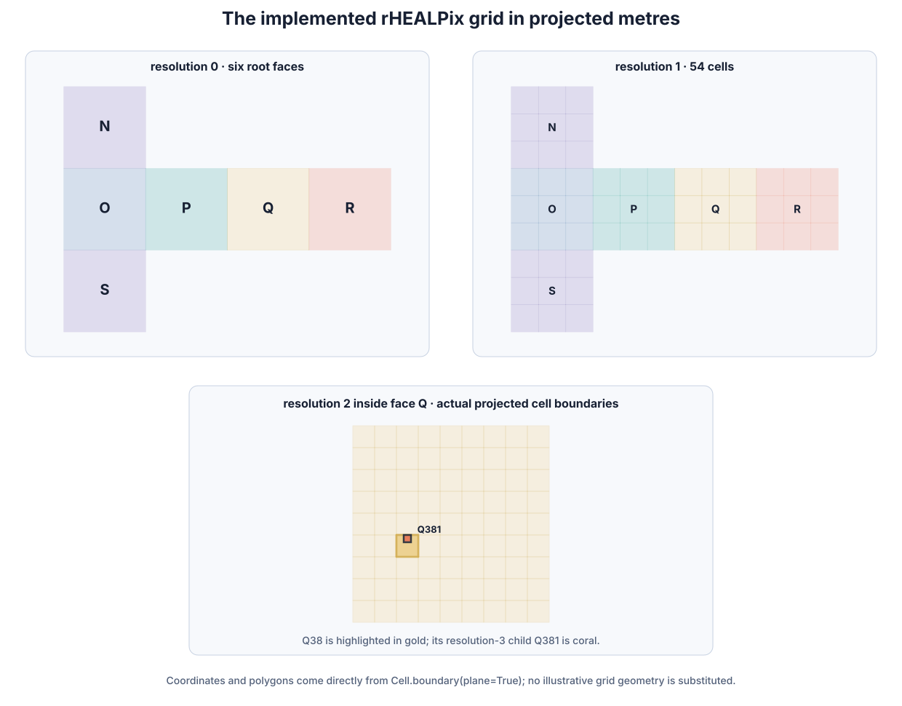
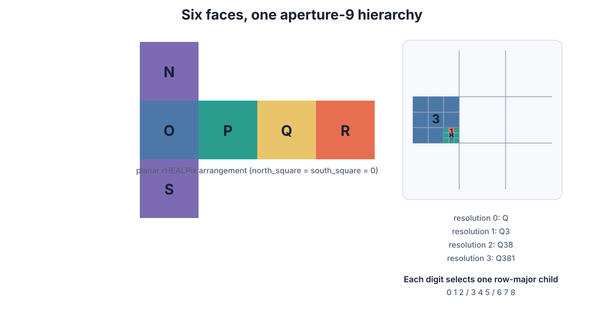
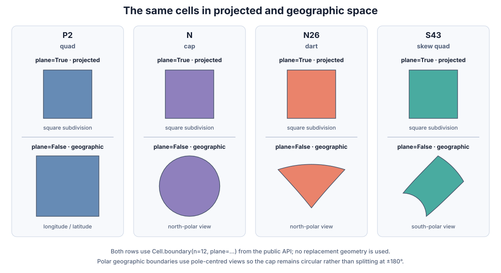
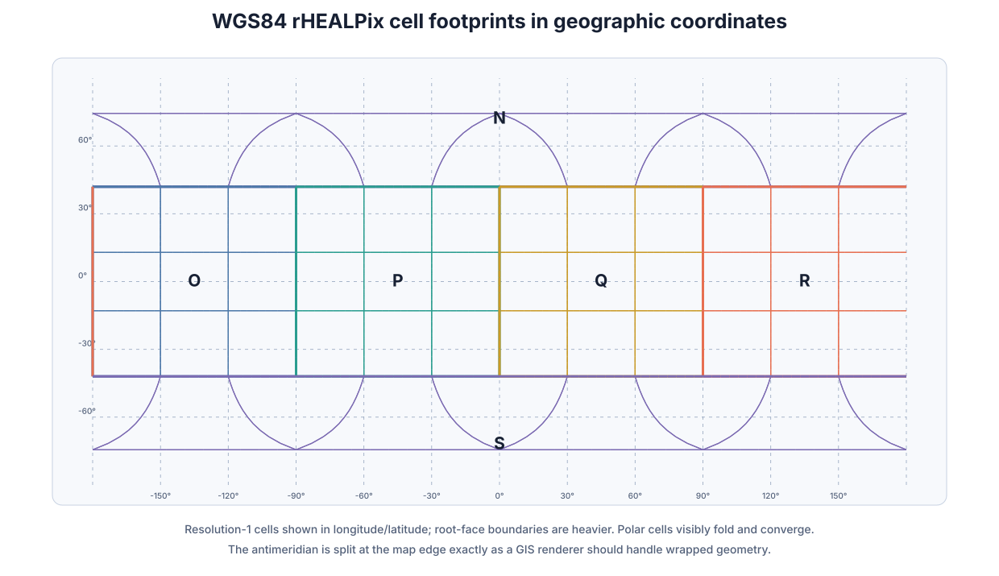
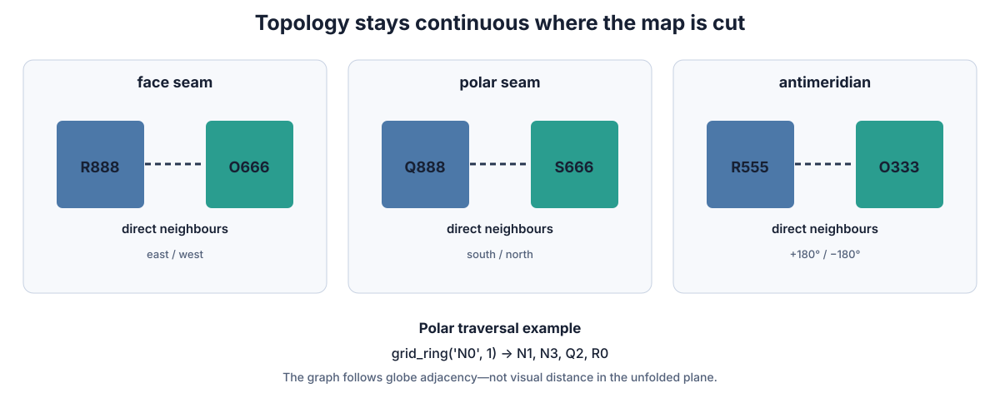
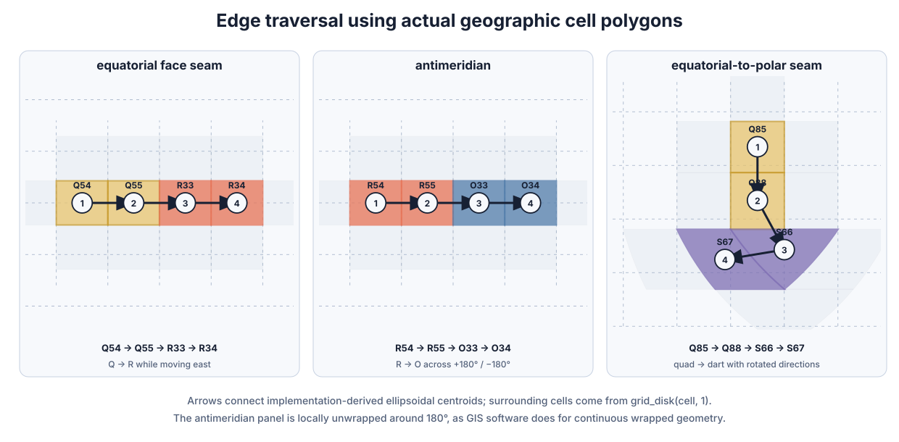
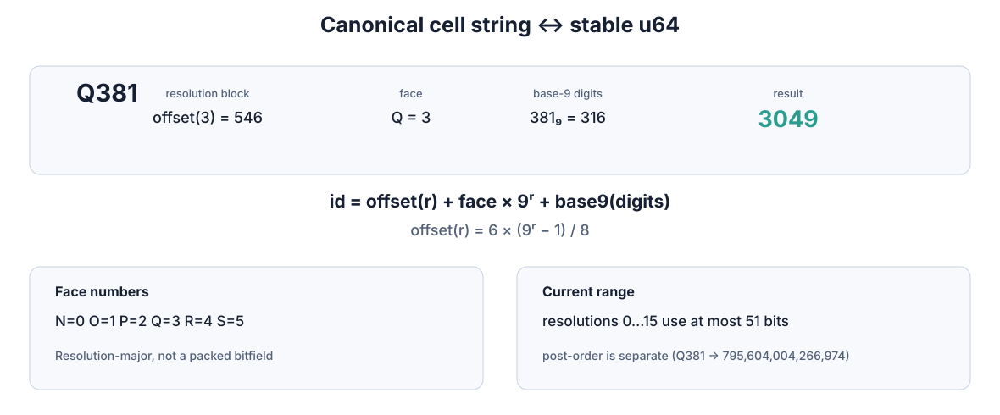
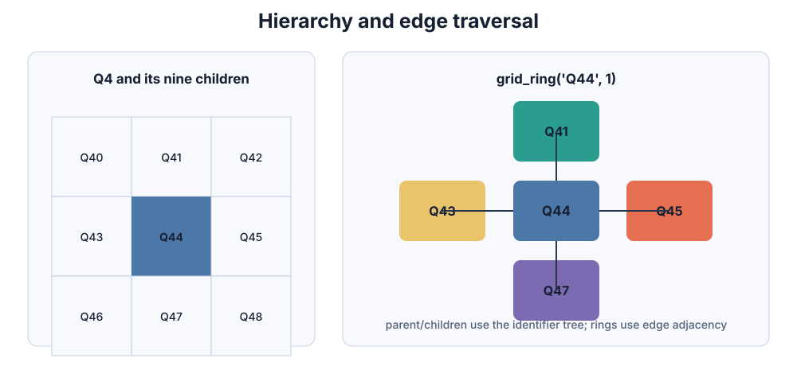

# rhealpixdggs-rs

A fast, Rust-first implementation of the **rHEALPix Discrete Global Grid
System**, with an H3-like Python API. rHEALPix divides the globe into six
equal-area faces and recursively subdivides every cell into a 3×3 grid: an
aperture-9 hierarchy that remains traversable across projection seams, polar
folds, and the antimeridian.


The cover uses actual densified resolution-1 boundaries, translucent face
colours, orthographic horizon clipping, and a bundled Natural Earth 1:110m
continent outline. It is generated entirely offline with the other figures.



This is the implemented WGS84 rHEALPix plane rather than an illustrative grid:
every outline is generated from `Cell.boundary(plane=True)`. The top panels show
the complete grid at resolutions 0 and 1; the lower panel shows real
resolution-2 cells inside face `Q`, with `Q38` and its child `Q381` highlighted.



The dependency-light Rust core owns projection, identifiers, hierarchy,
topology, coverage, and metrics. PyO3 exposes the same algorithms to Python;
NumPy and optional GeoPackage adapters handle practical vector workflows.

## The grid in one minute

The six root cells are `N`, `O`, `P`, `Q`, `R`, and `S`. A child digit from
`0` to `8` selects one square in the parent's row-major 3×3 subdivision. Thus
`Q381` is the path `Q → Q3 → Q38 → Q381`, at resolution 3.

The planar grid is square, but inverse projection folds the two polar faces
onto the ellipsoid. That produces four geographic shape classes in the current
implementation: quads, caps, darts, and skew quads.



The same cells can be rendered as ordinary EPSG:4326-style longitude/latitude
geometry. This view uses densified boundaries from the library, splits wrapped
edges at ±180°, and shows how the polar faces converge around the poles:



Cells that look separated in the unfolded projection can share an edge on the
globe. Neighbour traversal follows this topology, including face rotations at
the poles and direct adjacency across ±180° longitude.



The corresponding GIS view below uses actual geographic cell polygons,
ellipsoidal centroids, and neighbours returned by the implementation. The
arrows traverse an equatorial face seam, the antimeridian, and an
equatorial-to-polar seam where a quadrilateral enters a dart cell.



## Stable cell IDs

Human-readable identifiers convert losslessly to and from a deterministic
`u64`. The integer is **resolution-major**, not an H3-style packed bitfield:

```text
id = resolution_offset(r) + face_number × 9ʳ + base9(child_digits)
resolution_offset(r) = 6 × (9ʳ − 1) / 8     for r > 0
```

Faces map as `N=0`, `O=1`, `P=2`, `Q=3`, `R=4`, and `S=5`. For example,
`Q381 ↔ 3049`. Resolutions 0 through 15 currently fit within 51 bits, while
`u64` remains the stable public representation. Post-order traversal is a
separate ordering and must not be confused with this interchange ID.



Parent/child functions operate on the identifier tree. `grid_disk` and
`grid_ring` instead walk the four edge-neighbour graph, so they continue across
the seams shown above.



## Python quick start

For development, Conda keeps Rust, Maturin, PROJ, GDAL, and their Python
bindings in one compatible environment:

```bash
conda env create -f environment-dev.yml
conda activate rhealpix-dev
maturin develop --release
pytest
```

On Windows, install Visual Studio Build Tools with **Desktop development with
C++** (MSVC x64/x86 plus a Windows SDK); VS Code alone does not provide
`link.exe`.

```python
import rhealpixdggs as rh

cell = rh.latlng_to_cell(-40.356, 175.611, 12)
assert cell == "R887560473610"

lat, lng = rh.cell_to_latlng(cell)
boundary = rh.cell_to_boundary_densified(cell, points_per_edge=16)
parent = rh.cell_to_parent(cell)
children = rh.cell_to_children(parent)
neighbors = rh.cell_to_neighbors(cell, plane=False)
ring = rh.grid_ring(cell, 2)

integer_id = rh.str_to_int(cell)
assert rh.int_to_str(integer_id) == cell
```

The H3-like Python functions use `(latitude, longitude)`. The Rust core and the
upstream-compatible `RHEALPixDGGS`/`Cell` facade use conventional
`(longitude, latitude)` coordinates.

### Polygon coverage

Centroid coverage preserves the historical `rhealpixdggs-py` polyfill rule.
Intersection coverage selects every cell whose closed geometry touches the
polygon, including edge-only and corner-only contact:

```python
polygon = [
    (-40.36, 175.60),
    (-40.34, 175.60),
    (-40.34, 175.63),
    (-40.36, 175.63),
]

centroid_cells = rh.polygon_to_cells(polygon, 12)
touching_cells = rh.polygon_to_cells_intersects(polygon, 12)
assert set(centroid_cells) <= set(touching_cells)
```

Both modes support holes, antimeridian-crossing polygons, polar cells, and
recursive compaction. Tiny valid slivers are accepted using scale-relative,
numerically robust ring validation.

### NumPy and GeoPackage workflows

```python
import numpy as np
from rhealpixdggs import numpy as rhnp

points = np.array([[-40.356, 175.611], [37.7749, -122.4194]])
cells = rhnp.latlngs_to_cells(points, 12)
boundaries = rhnp.cells_to_boundaries(cells, points_per_edge=16)
```

Bulk calls release the GIL and can use Rayon. Install the `geo` extra to cover
Polygon/MultiPolygon input and write antimeridian-safe EPSG:4326 GeoPackages:

```bash
python -m pip install -e '.[geo]'
rhealpix-to-gpkg nz.gpkg nz-cells.gpkg -r 6 --coverage-mode intersects
```

```python
from rhealpixdggs.geo import polygon_file_to_geopackage

frame = polygon_file_to_geopackage(
    "nz.gpkg",
    "nz-cells.gpkg",
    resolution=6,
    coverage_mode="intersects",
)
```

## Rust quick start

```rust
use rhealpixdggs::RhealpixDggs;

let dggs = RhealpixDggs::wgs84_003();
let cell = dggs.cell_from_lonlat(175.611, -40.356, 12)?;
assert_eq!(cell.to_string(), "R887560473610");

let touching = dggs.cells_from_polygon_lonlat_intersects(
    8,
    &[(175.0, -40.0), (175.1, -40.0), (175.1, -39.9)],
    &[],
    false,
)?;
# Ok::<(), rhealpixdggs::Error>(())
```

## Performance

Recorded benchmarks include a roughly 41.8× warmed single-point Python speedup
and a matched Windows New Zealand resolution-6 coverage run that selected the
same 1,859 centroid cells while completing the Rust coverage phase about
4,974× faster than `rhealpixdggs-py` 0.6.0. These are workload-specific
measurements, not universal claims; see [BENCHMARKS.md](BENCHMARKS.md) for the
hardware, commands, raw results, and limitations.

## Documentation

- [Documentation site](https://chocopiekewpie.github.io/rhealpixdggs-rs/) —
  concepts, quickstarts, recipes, and the complete task-oriented API reference
- [Documentation source](src/content/docs/index.mdx)
- [API and implementation status](src/content/docs/engineering/api-status.md)
- [Architecture](src/content/docs/engineering/architecture.md)
- [Development and figure regeneration](src/content/docs/engineering/development.md)
- [Numerical accuracy](src/content/docs/engineering/numerical-accuracy.md)
- [Upstream compatibility](src/content/docs/engineering/upstream-compatibility.md)
- [Upstream v0.7 issue audit](src/content/docs/engineering/upstream-v0-7-audit.md)
- [Roadmap](ROADMAP.md)

Build the Starlight documentation locally with `npm install` followed by
`npm run dev`. Use `npm run build` for the checked production build.

Version 0.10.1 is pre-1.0. The WGS84 aperture-9 surface is extensively tested
against versioned upstream corpora; custom apertures and complete drop-in
compatibility are not yet promised.

## Licence and attribution

MIT. Maintained by James Ardo and contributors. Projection and indexing
mathematics were ported from
[`manaakiwhenua/rhealpixdggs-py`](https://github.com/manaakiwhenua/rhealpixdggs-py)
under its MIT licence option. See [LICENSE](LICENSE) and [NOTICE](NOTICE).
