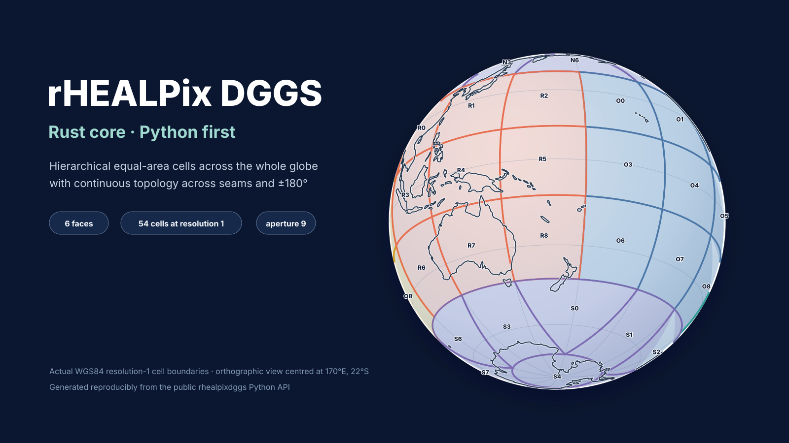

<div class="rhp-hero" markdown>

# One global grid. Two fast APIs.

`rhealpixdggs-rs` is a Rust implementation of the rHEALPix Discrete Global
Grid System with a Python-first interface. It turns coordinates, lines, boxes,
and polygons into stable hierarchical cell identifiers while preserving
topology across polar folds, face seams, and the antimeridian.

<div class="rhp-badges">
  <span class="rhp-badge">Aperture 9</span>
  <span class="rhp-badge">Equal-area cells</span>
  <span class="rhp-badge">Rust core</span>
  <span class="rhp-badge">Python ≥ 3.9</span>
  <span class="rhp-badge">Stable u64 IDs</span>
</div>

[Start with Python](getting-started/python.md){ .md-button .md-button--primary }
[Browse the API](api/index.md){ .md-button }

</div>

<figure class="rhp-cover" markdown>



</figure>

## What rHEALPix gives you

Every location belongs to one cell at a chosen resolution. Six root faces—`N`,
`O`, `P`, `Q`, `R`, and `S`—subdivide recursively into 3×3 groups. A canonical
identifier such as `R88756047` records that path through the hierarchy.

The projection is planar and square-cell based, but the geographic boundaries
are curved on the ellipsoid. Near the poles, the inverse projection produces
caps, darts, and skew quadrilaterals. The library handles those shapes as part
of the grid rather than treating them as exceptional GIS features.

<div class="grid cards" markdown>

-   :material-map-marker-radius: **Index spatial data**

    Convert one coordinate or millions of NumPy coordinates to canonical cell
    strings or compact integer IDs.

    [Indexing API →](api/indexing.md)

-   :material-vector-polygon: **Cover regions**

    Fill polygons by centroid membership or select every cell that touches the
    region. Holes and antimeridian crossings are supported.

    [Coverage semantics →](concepts/coverage.md)

-   :material-transit-connection-variant: **Traverse continuously**

    Walk neighbours, disks, and rings across face seams and polar rotations
    using the implemented edge-topology graph.

    [Topology API →](api/topology.md)

-   :material-database-outline: **Store stable IDs**

    Convert canonical strings losslessly to deterministic `u64` values for
    databases, Arrow, Parquet, and cross-language interchange.

    [Cell identifiers →](concepts/cell-ids.md)

</div>

## A first cell

```python
import rhealpixdggs as rh

cell = rh.latlng_to_cell(-40.356, 175.611, resolution=8)
print(cell)                       # R88756047
print(rh.str_to_int(cell))        # stable integer form
print(rh.cell_to_neighbors(cell, plane=False))
```

!!! warning "Coordinate order"
    The H3-style Python API uses `(latitude, longitude)`. The Rust API and the
    upstream-compatible object facade use `(longitude, latitude)`. Each API
    reference page states its convention explicitly.

## Where to go next

1. [Install the package](getting-started/installation.md).
2. Complete the [Python quickstart](getting-started/python.md).
3. Aggregate public New Zealand crash points in the
   [Waka Kotahi CAS recipe](recipes/cas-crash-density.md).
4. Use the [API reference](api/index.md) while building your own workflow.

Version 0.10.1 is pre-1.0. The WGS84 aperture-9 surface is extensively tested
against versioned upstream corpora, but API stability is not yet guaranteed.
