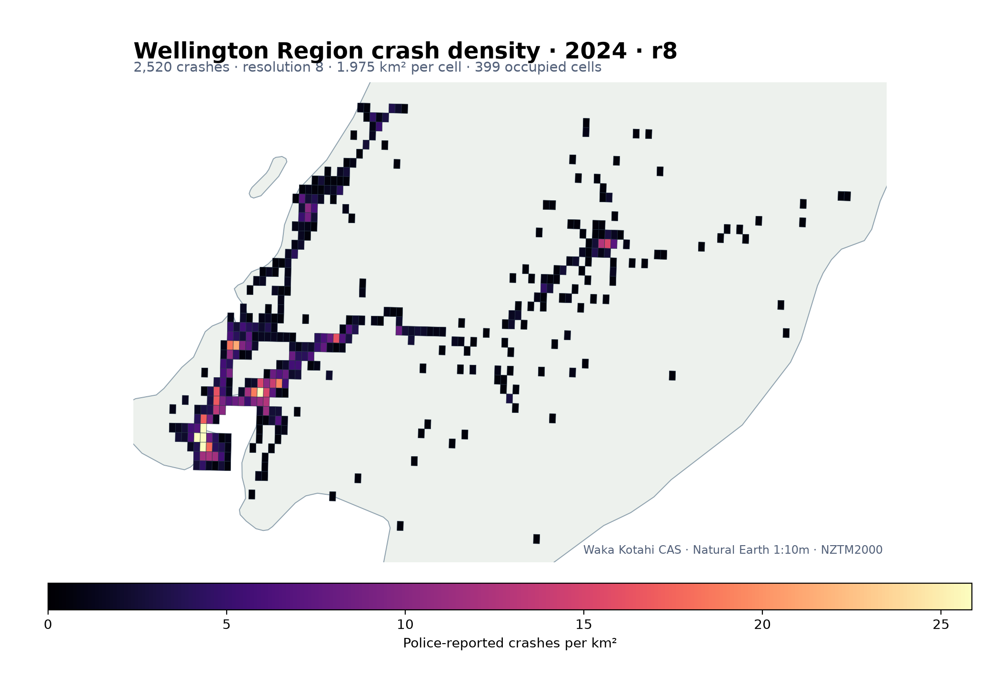
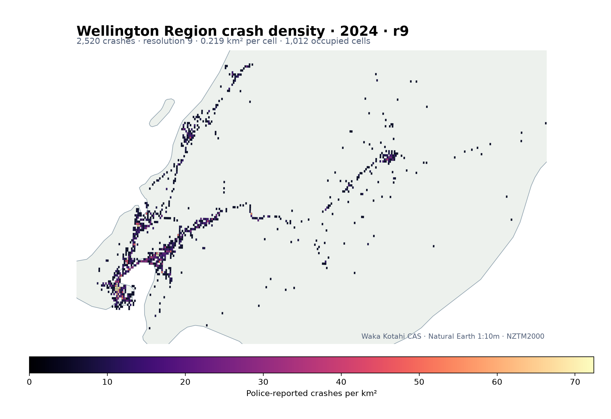

# Waka Kotahi CAS crash density

This recipe aggregates police-reported road crashes into equal-area rHEALPix
cells. It demonstrates a practical point-indexing workflow using the public
[Waka Kotahi Crash Analysis System (CAS) dataset](https://opendata-nzta.opendata.arcgis.com/datasets/NZTA::crash-analysis-system-cas-data-1/about).

The worked query uses crashes from 2024 in the Wellington Region. Change the
SQL-like `where` expression to select another year or region.

## What we will build

1. Page through the public ArcGIS Feature Service.
2. Request WGS84 point geometry directly from the service.
3. Index every crash with one NumPy-to-Rust call.
4. Count crashes and injuries per resolution-8 cell.
5. Calculate crashes per square kilometre.
6. Export an EPSG:4326 GeoPackage suitable for QGIS.

Resolution 8 is a useful regional overview: every cell covers approximately
1.975 km². Use resolution 9 (~0.219 km²) for a more local view, remembering
that sparse cells become more sensitive to individual records.

## Example output at resolutions 8 and 9

The live public layer returned 2,520 located crash records for this Wellington
Region 2024 query. Both maps below come from the complete example script. The
GeoPackages retain every record; the documentation maps use a robust regional
viewport so a remotely located source record does not compress the Wellington
cells into an unreadable corner. Each map caps its colour scale at its own 99th
percentile, so use the legend in each panel rather than comparing colours
directly between resolutions.

<div class="rhp-map-grid" markdown>

<figure markdown>

[](../images/wellington-cas-2024-r8.png)

<figcaption><strong>Resolution 8.</strong> 399 occupied cells; each cell is approximately 1.975 km². Click for the full-size map.</figcaption>

</figure>

<figure markdown>

[](../images/wellington-cas-2024-r9.png)

<figcaption><strong>Resolution 9.</strong> 1,012 occupied cells; each cell is approximately 0.219 km². Click for the full-size map.</figcaption>

</figure>

</div>

## Install dependencies

```bash
python -m pip install "rhealpixdggs-rs[geo]" requests pandas matplotlib
```

From a source checkout after `maturin develop --release`:

```bash
python -m pip install -e ".[geo]" requests pandas matplotlib
```

## Download the selected crashes

The service limits one response to 2,000 records. Request an explicit field
list, order by the stable ArcGIS object ID, and continue until the transfer
limit flag disappears:

```python
from __future__ import annotations

import geopandas as gpd
import requests

CAS_QUERY_URL = (
    "https://services.arcgis.com/CXBb7LAjgIIdcsPt/arcgis/rest/services/"
    "CAS_Data_Public/FeatureServer/0/query"
)


def fetch_cas(where: str) -> gpd.GeoDataFrame:
    features: list[dict] = []
    offset = 0

    with requests.Session() as session:
        while True:
            response = session.get(
                CAS_QUERY_URL,
                params={
                    "where": where,
                    "outFields": (
                        "OBJECTID,crashYear,crashSeverity,fatalCount,"
                        "seriousInjuryCount,minorInjuryCount,region"
                    ),
                    "returnGeometry": "true",
                    "outSR": 4326,
                    "orderByFields": "OBJECTID",
                    "resultOffset": offset,
                    "resultRecordCount": 2000,
                    "f": "geojson",
                },
                timeout=60,
            )
            response.raise_for_status()
            payload = response.json()
            page = payload.get("features", [])
            features.extend(page)

            if not page or not payload.get("properties", {}).get(
                "exceededTransferLimit", False
            ):
                break
            offset += len(page)

    if not features:
        raise ValueError(f"CAS query returned no crash points: {where}")
    frame = gpd.GeoDataFrame.from_features(features, crs="EPSG:4326")
    frame = frame.loc[frame.geometry.notna() & ~frame.geometry.is_empty].copy()
    if frame.empty:
        raise ValueError(f"CAS query returned no located crash points: {where}")
    return frame


crashes = fetch_cas(
    "crashYear = 2024 AND region = 'Wellington Region'"
)
print(f"Downloaded {len(crashes):,} crash records")
```

The field names and meanings are maintained in the official
[CAS data field descriptions](https://opendata-nzta.opendata.arcgis.com/pages/cas-data-field-descriptions).

## Index and aggregate

GeoPandas points use `(longitude, latitude)`. The NumPy rHEALPix function wants
columns in `(latitude, longitude)`, so the column stack intentionally reverses
the geometry order:

```python
import numpy as np
import rhealpixdggs as rh
from rhealpixdggs import numpy as rhnp

resolution = 8
coordinates = np.column_stack(
    (crashes.geometry.y.to_numpy(), crashes.geometry.x.to_numpy())
)

count_fields = ["fatalCount", "seriousInjuryCount", "minorInjuryCount"]
crashes[count_fields] = crashes[count_fields].fillna(0).astype("int64")
crashes["cell_u64"] = rhnp.latlngs_to_cells(coordinates, resolution)

summary = (
    crashes.groupby("cell_u64", as_index=False)
    .agg(
        crash_count=("OBJECTID", "size"),
        deaths=("fatalCount", "sum"),
        serious_injuries=("seriousInjuryCount", "sum"),
        minor_injuries=("minorInjuryCount", "sum"),
    )
)
summary["cell_id"] = [rh.int_to_str(int(value)) for value in summary.cell_u64]
```

This keeps the compact `uint64` representation through the expensive grouping
step and converts only the distinct output cells back to readable IDs.

## Build cell polygons and export

```python
from rhealpixdggs import geo as rhgeo

cells = rhgeo.cells_to_geodataframe(
    summary["cell_id"],
    points_per_edge=8,
)

density = cells.merge(summary, on="cell_id", validate="one_to_one")
density["crashes_per_km2"] = (
    density["crash_count"] / (density["area_m2"] / 1_000_000.0)
)

rhgeo.write_geopackage(
    density,
    "wellington-cas-r8.gpkg",
    layer="cas_crash_density",
    overwrite=True,
)
```

The GeoPackage includes canonical string and integer cell IDs, equal-area cell
area, crash count, injury totals, density, and antimeridian-safe cell geometry.

## Make a quick map

```python
import matplotlib.pyplot as plt

ax = density.to_crs(2193).plot(
    column="crashes_per_km2",
    cmap="magma",
    legend=True,
    linewidth=0.15,
    edgecolor="#243447",
    figsize=(9, 10),
    missing_kwds={"color": "#eeeeee"},
)
ax.set_axis_off()
ax.set_title("Police-reported crashes per km² — Wellington Region, 2024")
plt.tight_layout()
plt.savefig("wellington-cas-r8.png", dpi=200, bbox_inches="tight")
```

The bundled `save_plot()` helper also adds the higher-detail Natural Earth
1:10 million New Zealand land outline and uses a robust viewport for regional
data. The shorter snippet above is useful when you want complete control over
the Matplotlib figure.

## Run the complete example

The repository includes the full script with year, region, resolution, output,
and plot arguments:

```bash
python examples/cas_crash_density.py \
  --year 2024 \
  --region "Wellington Region" \
  --resolution 8 \
  --output wellington-cas-r8.gpkg \
  --plot wellington-cas-r8.png
```

Repeat with `--resolution 9`, `--output wellington-cas-r9.gpkg`, and
`--plot wellington-cas-r9.png` to create the finer map.

## Interpretation and limitations

Equal-area cells make counts per square kilometre directly comparable, but a
crash-density grid is not itself a road-risk model. Exposure—traffic volume,
road length, vehicle kilometres travelled, and reporting practices—also
matters. CAS contains crashes reported to Waka Kotahi by New Zealand Police;
the live public layer can be corrected or extended after this recipe is run.
